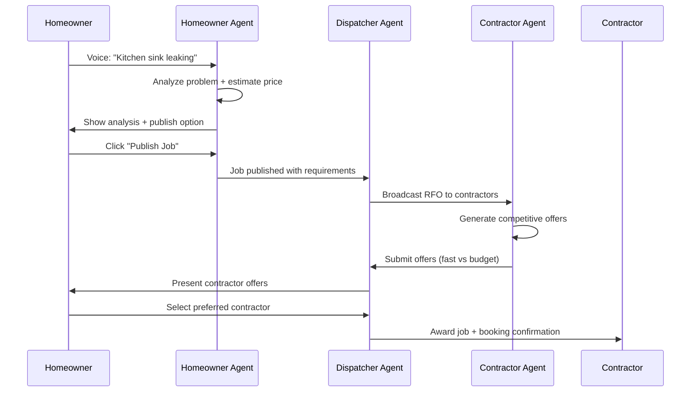

# FixNow Architecture

## 🏗️ System Overview

```
┌─────────────────┐    ┌─────────────────┐    ┌─────────────────┐
│  Homeowner      │    │   Dispatcher    │    │   Contractor    │
│     Agent       │    │     Agent       │    │     Agent       │
│                 │    │                 │    │                 │
│ • Voice Analysis│◄──►│ • Job Routing   │◄──►│ • Bid Generation│
│ • Photo Triage  │    │ • RFO Broadcast │    │ • Offer Creation│
│ • Price Estimate│    │ • Offer Collection│   │ • ETA Calculation│
└─────────────────┘    └─────────────────┘    └─────────────────┘
         │                       │                       │
         └───────────────────────┼───────────────────────┘
                                 │
                    ┌─────────────────┐
                    │   React UI      │
                    │                 │
                    │ • Agent Ticker  │
                    │ • Voice Interface│
                    │ • Map Visualization│
                    │ • Booking System │
                    └─────────────────┘
```

## 🤖 Agent Responsibilities

### Homeowner Agent
- **Input Processing**: Voice recognition and photo analysis
- **Problem Understanding**: Category detection and issue classification
- **Price Estimation**: Market-rate analysis for SF area
- **Job Publishing**: Structured job creation with requirements

### Dispatcher Agent  
- **Job Coordination**: Intelligent routing to qualified contractors
- **RFO Broadcasting**: Request for Offers to contractor network
- **Offer Management**: Collection, comparison, and presentation
- **Award Processing**: Job assignment and booking confirmation

### Contractor Agent
- **Bid Strategy**: Multiple personas (speed vs budget focused)
- **Geographic Optimization**: Location-based job filtering
- **Competitive Analysis**: Market-aware pricing and ETA
- **Response Generation**: Professional offer creation

## 🔄 Workflow Sequence



## 🛠️ Technical Stack

### Frontend (React + TypeScript)
- **Voice Interface**: Web Speech API integration
- **Map Visualization**: Leaflet with custom markers
- **Real-time Updates**: Agent activity ticker
- **Responsive Design**: Mobile-optimized UI

### Agent Layer
- **Demo Mode**: Bulletproof simulation for GitHub Pages
- **Fallback System**: Graceful degradation without backend
- **Event System**: Real-time agent coordination
- **State Management**: React hooks with persistent data

### Data Layer
- **Mock Data**: Comprehensive SF-based dataset
- **Geographic Data**: Real SF coordinates and neighborhoods  
- **Contractor Profiles**: Realistic ratings and specialties
- **Job Categories**: Plumbing, Electrical, HVAC coverage

## 🎯 Demo Mode Architecture

```
GitHub Pages (Static Hosting)
├── React App Bundle
├── Mock Data Layer
│   ├── Jobs (20+ realistic entries)
│   ├── Contractors (verified SF businesses)
│   └── Agent Events (collaboration simulation)
├── Agent Simulation Engine
│   ├── Voice Processing (mock analysis)
│   ├── Photo Analysis (mock diagnosis)
│   └── Offer Generation (realistic bids)
└── UI Components
    ├── Voice Agent Interface
    ├── Interactive SF Map
    ├── Agent Activity Ticker
    └── Booking Management
```

## 🚀 Deployment Strategy

- **Zero Backend**: Entirely client-side for reliability
- **GitHub Pages**: Professional hosting with custom domain
- **CDN Delivery**: Fast global access for judges
- **Offline Capable**: Works without internet after initial load
